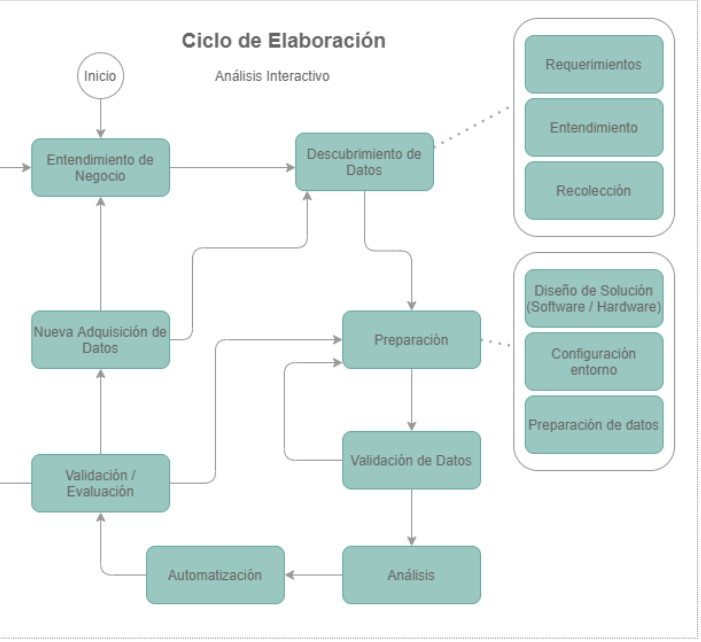

# Documentos de planificación y gestión de proyectos

- [Documentos de planificación y gestión de proyectos](#documentos-de-planificación-y-gestión-de-proyectos)
  - [Roles](#roles)
    - [Científico de datos](#científico-de-datos)
    - [Ingeniero de datos](#ingeniero-de-datos)
    - [Ingeniero de operaciones](#ingeniero-de-operaciones)
  - [Metodología](#metodología)

## Roles

Para la implementación del prototipo de analítica se adoptó  el esquema básico de “Tres equipos” propuesto por Anderson (Anderson, J. 2020. Data Teams. Apress. https://doi.org/10.1007/978-1-4842-6228-3).  

Tales equipos técnicos se componen de los siguientes roles: Científico de datos, Ingeniero de datos e Ingeniero de operaciones.   

###    Científico de datos 

Responsable de aplicar las técnicas de analítica de datos requeridas para el proyecto destinadas a la generación de modelos que den solución al problema de negocio planteado. 

###    Ingeniero de datos 

Responsable de las tareas técnicas asociadas a la gestión de los datos, como, por ejemplo, preparación, extracción, transformación, limpieza y validación, entre otros.  

Adicionalmente se encarga de la definición de la infraestructura y software requerido para el desarrollo del proyecto y la creación de programas o rutinas de automatización relacionadas con el manejo de los datos. 

###    Ingeniero de operaciones 

Encargado de las siguientes tareas: 

*    Operación en producción de las soluciones desarrolladas por el científico de datos y el ingeniero de datos,  
*    Instalación y configuración de software. 
*    Mantenimiento y monitoreo del software. 

## Metodología

La metodología utilizada para el desarrollo del proceso está basada en el ciclo de elaboración propuesto por IBM en ASUM-DM (Analytics Solutions Unified Method) en el año 2015.

ASUM-DM es una versión extendida de la metodología tradicional para minería de datos conocida como CRISP-DM.

El ciclo de elaboración se compone de las siguientes fases: 

*    Inicio: Creación del plan de proyecto. 

*    Entendimiento del negocio: Busca dar claridad a los objetivos y requerimientos del proyecto desde la perspectiva del negocio en particular.  

*    Descubrimiento de datos: A partir de los requerimientos se recolectan los datos iniciales con el fin de entenderlos, describirlos, explorarlos y verificar su calidad.  

*    Preparación: Esta fase se encarga del diseño y preparación de los   entornos y datos a utilizar.  

*    Validación de datos: Ocurre inmediatamente después de la preparación de los datos y antes del modelado. Este paso es necesario porque durante la preparación existe una gran posibilidad de ocurrencia de errores, especialmente en escenarios complejos. 

*    Análisis:  Construcción del modelo a través de múltiples iteraciones en donde se van refinando los diferentes parámetros utilizados para el entrenamiento.  En ocasiones es necesario establecer  nuevos requerimientos respecto a los datos a utilizar.

*    Automatización:  Esta fase aplica para aquellos proyectos que requieren la construcción de artefactos ejecutables como por ejemplo servicios web, interfaces de consulta, tableros de control, etc.

*    Validación / Evaluación: En esta fase se determina cuál o cuáles modelos son acertados o efectivos para ser considerados como “finales” según los criterios de éxito establecidos por el negocio. 

*    Nueva adquisición de datos:  Dada la naturaleza iterativa de la metodología en algunas ocasiones puede llegarse a la conclusión que con la información existente no es posible obtener resultados concluyentes. En ese orden de ideas se hace necesario identificar e incorporar nuevas fuentes de datos que puedan contribuir a la resolución del problema de análisis planteado para el proyecto.  

El flujo de trabajo a través de las diferentes fases puede ilustrarse a través de la siguiente imagen: 

