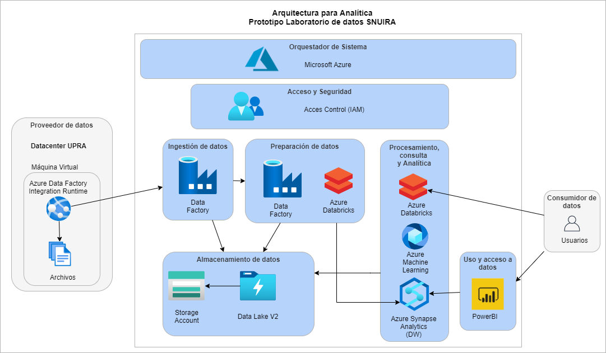

# Arquitectura

La arquitectura de referencia planteada para el desarrollo del proyecto se basa en las capas descritas  bajo  del marco de trabajo de interoperabilidad de Big Data NIST (NIST Big Data Interoperability Framework https://www.nist.gov/publications/nist-big-data-interoperability-framework-volume-6-big-data-reference-architecture-0 ). 

Las capas a tener en cuenta durante la implementación del sistema son las siguientes: 

*    Proveedor de datos

*    Orquestador de sistema

*    Acceso y seguridad

*    Almacenamiento de datos

*    Ingestión de datos

*    Preparación de datos

*    Procesamiento consulta y analítica

*    Uso y acceso a datos

Para la implementación de la arquitectura de referencia se utilizaron los los servicios de Microsoft Azure dispuestos en el Data Sandbox. La imagen a continuación contiene los elementos principales del sistema planteado: 

Las capas de la arquitectura de referencia se relacionan con los servicios de Microsoft de la siguiente forma:

*    Proveedor de datos: Máquina virtual desplegada en el datacenter de la UPRA con el componente Azure Data Factory Integration Runtime

*    Orquestador de sistema: Entorno de Microsoft Azure

*    Acceso y seguridad: Componente de Access Control (IAM) de Microsoft Azure

*    Almacenamiento de datos: Storage Account habilitando un Data Lake V2.

*    Ingestión de datos: Azure data factory

*    Preparación de datos: Azure data factory y Azure Databricks.

*    Procesamiento consulta y analítica: Azure Databricks Azure Machine Learning y Azure Synapse Analytics.

*    Uso y acceso a datos: PowerBI
