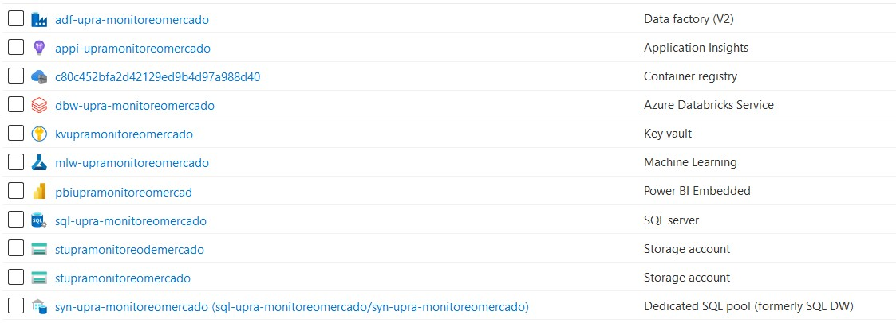

# Preparación 

## Servicios en la Nube pública de Microsoft Azure 

A través de la iniciativa “Data Sandbox”2  de MINTIC el proveedor Bextsa aprovisionó los siguientes recursos en la nube de Microsoft Azure:  

*    rg-upra-monitoreomercado: Grupo de recursos asignado al proyecto de SNUIRA dedicado al análisis del mercado de tierras. 

*    adf-upra-monitoreomercado: Recurso del servicio Azure Data Factory. 

*    dbw-upra-monitoreomercado: Servicio de Azure Databricks 

*    mlw-upramonitoreomercado: Servicio de Azure Machine Learning 

*    pbiupramonitoreomercad: Servicio de PowerBI  

*    sql-upra-monitoreomercado: Servicio de bases de datos SQL. 

*    Stupramonitoreodemercado: Servicio de almacenamiento de objetos asignado para soportar las operaciones de Azure Machine Learning. 

*    Stupramonitoreomercado: Servicio de almacenamiento de objetos asignado para la información del proyecto. 

*    syn-upra-monitoreomercado: Servicio de Datawarehouse de Azure Synapse Analytics 

El clúster de Spark proporcionado para análisis tiene las siguientes características: 

*   Modo: Standard 

*    Versión del entorno de ejecución: 7.1 ML (includes Apache Spark 3.0.0, Scala 2.12) 

*    Servidores de procesamiento: 4 Máquinas tipo Standard_DS5_v2 (56.0 GB Memory, 16 Cores, 3 DBU) distribuidas en 1 driver y 3 workers. 

Para el procesamiento de entrenamiento de los modelos creados en Azure Machine Learning se dispuso la siguiente capacidad de cómputo: 

*    Un nodo dedicado STANDARD_D2_V2 (2 Cores, 7 GB RAM, 100 GB Disk) de tipo CPU General purpose. 

## Infraestructura en el centro de datos de la UPRA 

Para facilitar el movimiento de datos entre el centro de datos de la UPRA y la nube de Azure se dispuso de una máquina virtual con las siguientes características:  

*    RAM: 8 GB  

*    Disco: 200 GB  

*    vCPU: 4 cores 

*    Sistema Operativo: Windows Server 2012 R2 Standard 

En dicha máquina se instaló la aplicación “Azure Data Factory Integration Runtime” la cual tiene como prerrequisito el entorno de Microsoft .NET Framework 4.6.2. 

## Datos

Durante la preparación de los datos se realizaron los siguientes procesos: 

*    Se encontró que los archivos JSON generados por la herramienta SAS tienen el problema que contienen todo el texto en la primera línea del archivo lo cual genera fallas en casi todas las herramientas de software que intentan procesarlos. 

*    Para los archivos JSON generados por SAS con un tamaño menor a 2 GB fue necesario extraer primero el arreglo de los datos contenido en el atributo definido con el nombre de la tabla generada utilizando pyspark.  Una vez extraído el arreglo  se convirtió a un formato tabular tipo parquet. 

*    Para procesar los archivos JSON (SAS) mayores a 2 GB fue necesario primero convertirlos al formato TSV utilizando un programa creado con la librería de python denominada Pandas. 

*    Se renombraron nombres de columnas con caracteres alfanuméricos no estándar (Ej. AÑO) 

*    Se generó la llave primaria para los archivos teniendo en cuenta la instrucción del usuario líder temático teniendo en cuenta el relleno de “0” a la izquierda para los diferentes atributos. 

*    Se realizó limpieza general de los textos libres teniendo en cuenta los siguietnes criterios: 

*   Conversión a mayúsculas 

*    Remover carácter coma doble (,,) por coma sencilla (,). 

*    Remover carácter espacio doble por espacio sencillo. 

*    Se eliminaron espacios al principio y final de la cadena. 

*    Se generó campo numérico que sirve como identificador único en el archivo. 

*    Se validaron transacciones registrales que ocurren en más de un año. (Anomalía de tipo temática). 

*    Para el campo de linderos se hace limpieza de caracteres de símbolos alrededor de las cadenas AREA y HECTAREA. 

*    Se realizó un análisis de frecuencia de las palabras contenidas en el campo de DIRECCION con el fin de determinar cuáles de dichas palabras están relacionadas con predios urbanos. 

*    Se incluyeron en el análisis aquellas transacciones de predios "SIN INFORMACION" que contienen direcciones diferentes a predios rurales según un conjunto de palabras establecido a través del análisis de frecuencias del punto anterior. (Rural inferido) 

*    Se filtró el archivo de transacciones para tener en cuenta únicamente predios rurales y predios rurales inferidos. 

*    Se removieron del campo del nombre (PERSONA) palabras “conectoras” tales como “DE”, “DE LA”, “LOS” entre otras. 

*    A partir del campo de personas al que se le realizó limpieza se derivaron nuevas columnas conteniendo la cantidad de palabras y la cantidad de caracteres “coma” que contiene. 

*    Se limpió el campo de número documento quitándo símbolo negativo al iniciar la cadena. 

*    Se derivó nueva columna “SEXO” teniendo en cuenta la clasificación de rangos según el sistema anterior de la registraduría (Rango de números para hombres y rango de números para mujeres) teniendo en cuenta números de cédula con 8 caracteres. 

*    A partir del tipo de documento se derivó nueva columna “TIPO” donde se clasifica al interviniente como “NACIONAL” o “EXTRANJERO”. 

*    A partir de información encontrada en datos.gov.co de SECOP y del DANE se generó un conteo de frecuencias de las palabras más comunes en nombres de empresas.   A partir de dicho conteo se generó un listado de palabras que sirve como filtro para determinar si un nombre pertenece o no a una PERSONA o EMPRESA. 

*    Se separó el texto de la columna PERSONA en nombres y apellidos según los siguientes patrones: 

*    Apellido Nombre 

*    Apellido1 Apellido2 Nombre1 Nombre2 

*    Apellidos , Nombres 

*    Se generaron listados de nombres de personas masculinos y femeninos según la clasificación generada a través del rango de cédulas. 

*    Se enriquece la información de transacción inmobiliaria teniendo en cuenta los siguientes criterios: 

*    Total de intervinientes 

*    Total de intervinientes de tipo empresa 

*    Total de intervinientes de tipo persona 

*    Total de intervinientes extranjeros 

*    Total de intervinientes nacionales 

*    Total de intervinientes hombres 

*    Total de intervinientes mujeres 

*    Información catastral alfanumérica del predio asociado teniendo en cuenta el código de la DIVIPOLA  la matrícula inmobiliaria. 

*    Información catastral geográfica del predio asociado 

*    Información de la vereda asociada según el registro del DANE. 

*    Información de las oficinas de registro y catastro más cercanas. 

*    Para facilidad de manipulación de la información, los datos originales y derivados se almacenan en el Data Lake en el formato Parquet. 

