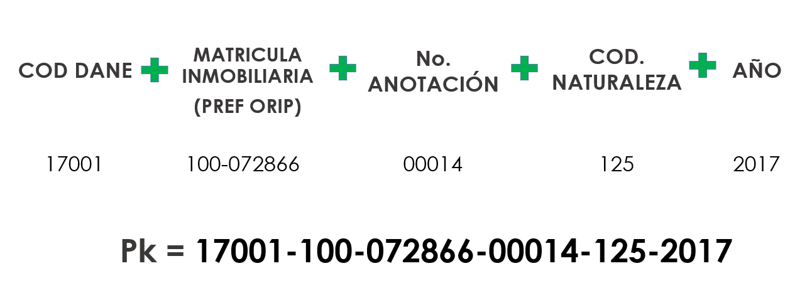

# Fases de Análisis

## 1.	Transacciones

Dentro de los principales pasos de diagrama de flujo de la temática de Transacciones están:

*    Conversión del archivo JSON originalmente exportado desde el software SAS (Statistical Analysis Software) por parte del grupo de Análisis de Información desde un tipo Single-Line a Multi-Line. Esto con el fin de evitar que quede almacenado una gran cantidad de información en una misma línea de texto(~2GB). Subsecuentemente esto facilita la lectura y manipulación de los datos de una forma más optima y eficiente.

*    Adecuación de aquellos campos necesarios para el análisis, esto incluye una depuración de potenciales registros duplicados a lo largo de todo el conjunto de datos.

*    Creación del archivo .parquet en el datalake con todo el consolidado de las Transacciones desde la vigencia 2015 a la 2019. Esto ayuda a que se manipule de una forma mas eficiente los datos para la extracción, transformación y cargue de los mismos.

*    Conformación de una llave primaria. Debido a la necesidad de distinguir de forma única cada registro del archivo compilado de Transacciones es necesario crear una llave primaria genérica. Esto garantizará la veracidad en las estimaciones y de las posteriores relaciones entre catastro-registro. Esta se conforma de la siguiente forma: 

*    Validación de registros duplicados teniendo en cuenta la llave primaria calculada en el paso anterior. Registros duplicados son desechados y se consolida una base de datos limpia.

*    Hallar potenciales Transacciones rurales que no están clasificadas desde los datos originales. Para ellos se aplican algoritmos que buscan dentro del campo “dirección” palabras claves (respaldadas temáticamente) almacenadas un diccionario que permitirán inferir registros de Transacciones que pueden ser consideradas Rurales.

*    Se generan y consolidan dos archivos de gran importancia para los siguientes procesos: Archivo de Transacciones Rurales y Linderos Rurales.

## 2.	Intervinientes

## 3.	Linderos

## 4.	Catastro R1R2

## 5.	Componente Geográfico