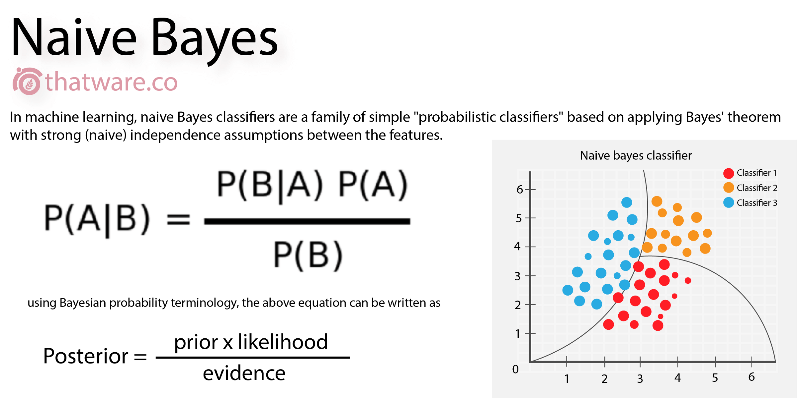

# Validación y evaluación de resultados

Luego de haber experimentado con ambos modelos de Machine Learning (Naive Bayes y Decision Trees) para la predicción de género basado en el nombre de los intervinientes podemos validar los siguientes estamentos: 

*    Se observó que, aunque los conjuntos de datos referentes a nombres en español dispuestos en el repositorio de Kaggle tienen un gran número de registros, muchos de ellos contienen nombres que no aplican para el caso del contexto nacional colombiano. Esto subsecuentemente genera ruido al momento del entrenamiento del modelo, al detectar patrones existentes en nombres tanto masculinos como femeninos que no se ajustan a nuestras necesidades.

*    Debido a la difícil obtención de un conjunto de datos históricos de nombres registrados en Colombia, se construyó un archivo basado en las frecuencias de nombres (primer nombre) de intervinientes que tuvo una revisión manual para el entrenamiento del modelo basado en Decision Trees. 

*    Aunque el conjunto de datos de nombres de intervinientes configurado para realizar el entrenamiento del modelo de Decision Trees tiene alrededor de 1500 nombres, el hecho de utilizar técnicas de feature extraction en el nombre, amplia el rango de características y por tanto de variables ingresadas al modelo. 

*    La precisión (Accuracy) de los modelos difiere por un valor de 0.03; dándole la ventaja al modelo de Decision Trees. De esta manera las predicciones de genero realizadas por este modelo son las que se van a aplicar para aquellos nombres de intervinientes que no pudieron ser clasificados por técnicas previas.

*    A continuación, se muestra un ejemplo de la clasificación de datos por los distintos modelos de ML:

 
 Tomado de https://thatware.co/naive-bayes/

 
 Tomado de https://thatware.co/naive-bayes/

*    Para finalizar es importante mencionar que estas clasificaciones requieren de una validación temática y manual por parte de los expertos, la cual también se puede enfocar a un trabajo colaborativo para mayor agilidad en el proceso.
