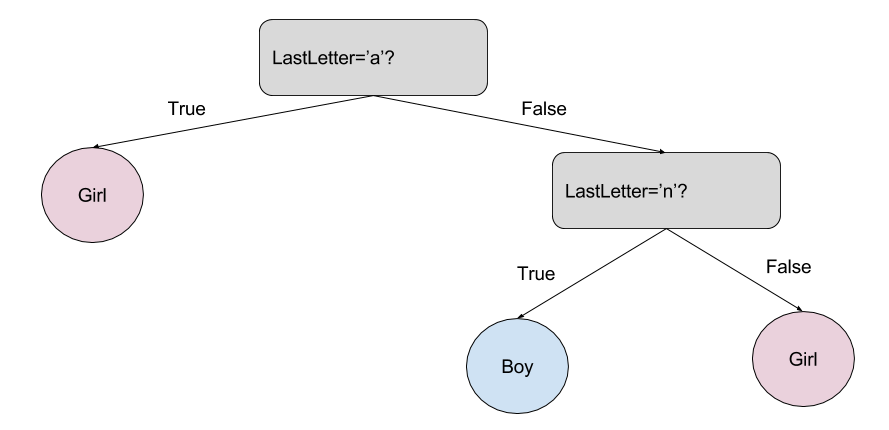

# Descripción - Automatización de modelos de datos

La automatización de los modelos que se detallan a continuación son basados en técnicas de aprendizaje de máquinas (Machine-Learning) de la fase de Intervinientes en donde el principal objetivo es realizar la clasificación del genero de cada uno de los intervinientes que no pudieron ser clasificados por ninguna de las técnicas inicialmente ejecutadas (Rangos de Cédula, Diccionario, Similaridad).

La selección del modelo más adecuado para realizar esta clasificación se fundamentó inicialmente en una revisión tanto como de literatura y repositorios de código en los que ya se hubiese tratado de abordar esta clasificación de genero únicamente basado en el nombre de los individuos. En este orden de ideas los modelos evaluados fueron Naive Bayes y Arboles de Decisión (Decision Trees). Vale la pena destacar que, aunque existen otros tipos de modelos, se trataron de seleccionar aquellos que más se acomodaran al contexto temático de los nombres a clasificar. En otras palabras, que se pudiesen adaptar al contexto nacional e idiomático.

	- [1.	Naive Bayes](#naive_bayes)
	- [2.	Decision Trees](#decision_trees)

## 1.	Método de Naive Bayes:

Descripción

*    El primer modelo seleccionado para experimentación es conocido como Naive Bayes (Clasificador Bayesiano Ingenuo). Este modelo utilizado generalmente en procesos de clasificación está soportado en la técnica de clasificación estadística (probabilística) del Teorema de Bayes. Este teorema asume desde un principio que las variables predictoras son independientes entre sí, en donde la presencia de una determinada característica o atributo no se encuentra relacionada en absoluto con la presencia de otra característica. A modo de ejemplo, las características asociadas a la descripción de una fruta como la sandía (color: verde, forma: elíptica, peso: 12kg, etc.) aportan de forma individual a la probabilidad de que la fruta que estamos analizando sea una sandía.

*    El empleo de este algoritmo específicamente para la predicción de genero está basado en artículos  como el de [Zhao H. & Kamareddine(2017)](http://www.macs.hw.ac.uk/~hz103/CSCI'17.pdf), [Akbar R.(2016)](https://www.researchgate.net/publication/308785770_Gender_Classification_of_Indonesian_Names_Using_Multinomial_Naive_Bayes_and_Random_Forrest_Classifiers), [Bird S.et al.(2009)](https://www.nltk.org/book/ch06.html); sin embargo debido al contexto idiomático y regional uno de los que mas se ajustaban era el algoritmo desarrollado por [Gil M.(2017)](https://www.kaggle.com/migalpha/spanish-names) dispuesto en el repositorio de Kaggle. Otra de las ventajas iniciales de este repositorio es que contaba con una amplia base de datos con nombres en español tanto de mujeres como de hombres (24756 y 24584 respectivamente). 

 
 Tomado de https://thatware.co/naive-bayes/

Implementación

*    Este algoritmo escrito en Python es adaptado e implementado desde Databricks tomando como datos de entrenamiento aquellos que inicialmente dispone el repositorio de Kaggle teniendo en cuenta que tienen un licenciamiento GPL2. 

*    Librerías propias de Spark son utilizadas para el llamado de datos desde el Data Lake; una vez los datos son almacenados en variables, su administración, adecuación y manipulación se basa en el uso de Pandas.

*    El modelo Naive Bayes se implementa utilizando la librería de aprendizaje automático de código abierto Scikit-learn. La configuración del modelo se realiza teniendo en cuenta una distribución de los datos de entrenamiento y testeo del 80% y 20% respectivamente.

*    El modelo implementa el método CountVectorizer con el fin de convertir en este caso la columna de texto (nombres de los intervinientes) en una matriz con valores de ocurrencia de cada uno de los términos que aparezcan en el texto. 

*    Seguidamente el modelo implementa el método TfidfTransformer el cual realiza la transformación de la matriz de ocurrencias inicialmente calculadas en una matriz normalizada de ocurrencias.

*    Para la selección de los mejores hiper-parámetros se utiliza la librería GridSearchCV, la cual itera diferentes hiper-parámetros predefinidos y ajusta el modelo sobre los datos de entrenamiento. Una vez ajustado el modelo se calcula la precisión (Accuracy) arrojando como resultado 0.85.

*    El modelo es almacenado en formato .pkl con el fin de automatizar posteriores ejecuciones e invocaciones del mismo para distintos datos a predecir.

*    Una vez el modelo es salvado se selecciona el conjunto de datos y campo que contienen los nombres de los intervinientes para clasificación de genero, en donde su predicción es calculada en un nuevo campo que se añadirá al conjunto de datos iniciales. Los datos finales son luego exportados y almacenados en el Data Lake a través de librerías de spark.

*    La correspondiente validación y conclusiones del modelo podrán observarse en la sección 10.

## 2.	Método de Arboles de Decisión

Descripción

*    El segundo modelo seleccionado e implementado para la clasificación de genero esta basado en Decision Trees (Arboles de Decision). Este modelo se basa en un diagrama o mapa de todos aquellos posibles resultados que dependen de decisiones relacionadas. El diagrama contiene nodos de decisión que validan los valores de las características y nodos de hoja que asignan un respectivo etiquetado. Generalmente el modelo comienza desde un nodo raíz donde se toma una decisión inicial basada en una condición que verifica un correspondientes valor de entrada; dependiendo del cumplimiento o no de la condición se selecciona una rama acorde a la característica validada. Continuando por la rama se puede o no encontrar un nuevo nodo de decisión con una nueva condición para seleccionar una nueva rama. Este proceso se sigue iterando hasta que no se encuentren mas condiciones y se alcance un nodo terminal (etiquetado) que asignará una etiqueta para el valor de entrada.

*    El uso de este algoritmo para la predicción de género basado en el nombre de las personas está apoyado en artículos como el del portal web de [Natural Language Processing for Hackers](https://nlpforhackers.io/introduction-machine-learning/), [Bird S.et al.(2009)](https://www.nltk.org/book/ch06.html) o el repositorio de código en GitHub de [Agbe J. (JCharis)](https://github.com/Jcharis/Python-Machine-Learning/blob/master/Gender%20Classification%20With%20%20Machine%20Learning/Gender%20Classification%20of%20Names%20With%20Machine%20Learning.ipynb). 

*    Aunque ninguno de estos algoritmos mencionados ha sido diseñado para ser aplicado en la clasificación de genero basado en nombres en español, fundamentan su aplicación para el primer nombre de una persona e implementan una extracción de características (feature extraction) muy importantes a la hora de evaluar los nombres de una persona para identificar el género. Dentro de esta extracción se encuentra la evaluación de cada una de las primeras tres letras y las tres últimas letras del nombre.

 
 Tomado de https://nlpforhackers.io/introduction-machine-learning/

Implementación 

*    Este algoritmo escrito en Python es adaptado e implementado desde Databricks tomando como datos de entrenamiento aquellos primeros nombres de intervinientes que fueron sujetos de una evaluación de frecuencia y revisión manual para la configuración de un conjunto de datos que se adaptasen de forma más cercana a las condiciones socio-culturales e idiomáticas de nombres registrados Colombia. De esta forma se conforma un conjunto de datos posee alrededor de 1500 nombres de hombres y mujeres con los cuales se entrena el modelo de árboles de decisión.

*    De nuevo librerías propias de Spark son utilizadas para el llamado de datos desde el Data Lake; una vez los datos son almacenados en variables, su administración, adecuación y manipulación se basa en el uso de Pandas.

*    El modelo de Decision Trees se implementa utilizando la librería de aprendizaje automático de código abierto Scikit-learn. 

*    El modelo también implementa el método CountVectorizer con el fin de convertir en este caso la columna de texto (nombres de los intervinientes) en una matriz con valores de ocurrencia de cada uno de las letras que aparezcan en el texto del nombre para luego transformar y ajustar la matriz.

*    Seguidamente se extraen (feature extraction) en un diccionario la primera letra, primeras dos letras, primeras tres letras, ultima letra, ultimas dos letras y ultimas tres letras para cada uno de los nombres. 

*    Estas características luego son vectorizadas utilizando el método vectorize de la librería numpy y organizadas en un nuevo diccionario utilizando el método DictVectorizer para ajustar un nuevo conjunto de datos de entrenamiento considerando las características extraídas.

*    Se configura el modelo para ser ejecutado desde una nueva función, teniendo en cuenta una distribución de los datos de entrenamiento y testeo del 80% y 20% respectivamente. La precisión del modelo (Accuracy) sobre los datos de testeo arroja un valor de 0.89.

*    Posteriormente la rutina invoca el modelo seleccionando el conjunto de datos y campo que contienen los nombres de los intervinientes para clasificación de genero considerando únicamente el primer nombre. La predicción es calculada en un nuevo campo que se añadirá al conjunto de datos iniciales. Los datos finales son luego exportados y almacenados en el Data Lake a través de librerías de spark.

*    La correspondiente validación y conclusiones del modelo podrán observarse en la sección 10.

- [Análisis y procesamiento de datos](#análisis-y-procesamiento-de-datos)
	- [1.	Transacciones](#1transacciones)
	- [2.	Intervinientes](#2intervinientes)
	- [3.	Linderos](#3linderos)
	- [4.	Catastro R1R2](#4catastro-r1r2)
	- [5.	Componente Geográfico](#5componente-geográfico)

## 1.	Transacciones

 

Dentro de los principales pasos del diagrama de flujo de la temática de Transacciones están:

*    Conversión del archivo JSON originalmente exportado desde el software SAS (Statistical Analysis Software) por parte del grupo de Análisis de Información desde un tipo Single-Line a Multi-Line. Esto con el fin de evitar que quede almacenado una gran cantidad de información en una misma línea de texto(~2GB). Subsecuentemente esto facilita la lectura y manipulación de los datos de una forma más optima y eficiente.

*    Adecuación de aquellos campos necesarios para el análisis, esto incluye una depuración de potenciales registros duplicados a lo largo de todo el conjunto de datos.

*    Creación del archivo .parquet en el datalake con todo el consolidado de las Transacciones desde la vigencia 2015 a la 2019. Esto ayuda a que se manipule de una forma mas eficiente los datos para la extracción, transformación y cargue de los mismos.

*    Conformación de una llave primaria. Debido a la necesidad de distinguir de forma única cada registro del archivo compilado de Transacciones es necesario crear una llave primaria genérica. Esto garantizará la veracidad en las estimaciones y de las posteriores relaciones entre catastro-registro. Esta se conforma de la siguiente forma: 

*    Validación de registros duplicados teniendo en cuenta la llave primaria calculada en el paso anterior. Registros duplicados son desechados y se consolida una base de datos limpia.

*    Hallar potenciales Transacciones rurales que no están clasificadas desde los datos originales. Para ellos se aplican algoritmos que buscan dentro del campo “dirección” palabras claves (respaldadas temáticamente) almacenadas un diccionario que permitirán inferir registros de Transacciones que pueden ser consideradas Rurales.

*    Se generan y consolidan dos archivos de gran importancia para los siguientes procesos: Archivo de Transacciones Rurales y Linderos Rurales.

## 2.	Intervinientes

 

Detallando el procesamiento desarrollado en la temática de Intervinientes se encuentran los siguientes pasos:

*    Generación de la llave primaría sobre el conjunto de datos original del consolidado de Intervinientes de las vigencias comprendidas entre el 2015 y 2019. La configuración de la llave obedece la misma forma que se detalla en la temática de Transacciones.

*    Aplicación de expresiones regulares al campo de “nombres” de intervinientes con el fin de efectuar una limpieza inicial.

*    Generar la clasificación de los intervinientes de acuerdo al tipo de documento que se encuentre registrado en el conjunto de datos. De esta forma se discriminan aquellos intervinientes Nacionales y Extranjeros. 

*    Limpiar y validar el campo donde se encuentra almacenado el número de documento de identidad. Este paso es necesario ya que desde los datos originales se encontraron muchas inconsistencias y errores que es necesario tratar de corregir en la medida de los posible.

*    Primera clasificación de genero de los intervinientes según el rango de cédula. Esta clasificación de genero se realizó únicamente para aquellos intervinientes en donde el número de cedula se encuentre entre los siguientes rangos:
		-	Hombres: Rangos del 1 al 19’000.000 y del 70’000.000 al 99’999.999
		-	Mujeres: Rango del 20’000.000 al 69’999.999
	 Es importante mencionar que este criterio en la numeración de hombres y mujeres fue establecido por la [registraduría](https://www.registraduria.gov.co/1-de-noviembre-de-2012-No-69-60.html) entre los años 1952 a 2003. Posterior a ello la asignación del documento de identidad obedece únicamente al NUIP donde no existen rangos de genero.

*    Extracción de nombres de empresas y empresas inferidas. Para estas últimas hubo la necesidad de configurar un diccionario con palabras que generalmente son asignadas a nombres de empresas.

*    Ejecución del procesamiento de nombres. Debido a que el campo de nombres no se encuentra estandarizado, es necesario tener en cuenta los diferentes casos de cómo están originalmente ubicados los nombres y apellidos en cada uno de los registros. Algunos ejemplos son:
		-	Apellido Nombre
		-	Apellido_1 Apelido_2 Nombre_1 Nombre_2
		-	Apellidos , Nombre
		-	Una sola palabra
		-	Múltiples Nombres
		-	Nombres de empresas marcados como personas
	 Una vez los nombres han sido limpiados se procede a extraer únicamente el primer nombre de cada interviniente ya que puede definir de forma certera el género de una persona.

*    Filtrado del conjunto de datos de intervinientes considerando únicamente aquellos que estén relacionados con Transacciones Rurales. Para ello se filtran considerando el conjunto de datos consolidado en el diagrama de flujo de Transacciones de la fase previa.

*    Aplicación de diferentes algoritmos y/o métodos secundarios para generar una clasificación por género de aquellos intervinientes que no pudieron ser clasificados con el método de rangos de cédula. Estos métodos secundarios están diseñados para que realicen la clasificación según el primer nombre del interviniente.

*    Es importante mencionar que para llevar a cabo la ejecución de esto métodos secundarios hubo la necesidad de construir un archivo de nombres comunes clasificados por género (hombre/mujer) para el contexto nacional (Colombia) que es validado manualmente para tener una mayor seguridad en la aplicación de métodos subsecuentes. 

	 - Método del Diccionario: Este método busca encontrar coincidencias en los primeros nombres de aquellos intervinientes que no fueron clasificados por el método de rango de cedula inicialmente, con el consolidado de nombres comunes que tuvo una validación manual. De esta forma nombres que casen de forma exacta serán clasificados por género.
	 - Método de Similaridad: Este método está orientado a clasificar el género de aquellos intervinientes que no fueron clasificados ni por el método de rangos de cédula, ni por el método de Diccionario mencionado anteriormente. En este orden ideas el método de Similaridad busca encontrar diferencias de un solo carácter entre el nombre a predecir y los nombres comunes que se encuentran clasificados previamente por el análisis de frecuencias. De esta forma se aplica el algoritmo de Levensthein para que encuentre coincidencias con una distancia de máximo 1 carácter y que la última letra del nombre a predecir coincida con el nombre común del diccionario.

	   Ejemplo:
	   - NEDIS (nombre a clasificar) y YUDIS (nombre clasificado previamente como Femenino) tiene una distancia-Levensthein de 2 aunque coinciden la ultima letra de los dos nombres. En este caso no se puede clasificar el nombre.
	   - NEDIS(nombre a clasificar) y LEDIS(nombre clasificado previamente como Femenino) tiene una distancia- Levensthein de 1, además de coincidr la ultima letra de los dos nombres. En este caso el nombre es clasificado como Femenino por similaridad.

*    Método de Machine – Learning: Este método está orientando a clasificar el genero de todos aquellos primeros nombres de intervinientes que no pudieron ser clasificados por los métodos previamente. Luego de hacer un testeo bajo una revisión de [algoritmos](https://nlpforhackers.io/introduction-machine-learning/) y [repositorios de código](https://github.com/Jcharis/Python-Machine-Learning/tree/master/Gender%20Classification%20With%20%20Machine%20Learning) que buscan solucionar problemas de esta envergadura, se decidió aplicar el algoritmo de Arboles de Decisión para la clasificación de genero basado únicamente en el primer nombre del interviniente.

*    Una vez clasificados todos los nombres de los intervinientes se realiza el conteo de los intervinientes que participaron transacciones rurales para finalmente generar un archivo consolidado que servirá para la generación de reportes y alimentar tableros de control.

## 3.	Linderos

 

Dentro de la fase correspondiente a Linderos se encuentran los siguientes procesos:

*    Limpieza del campo que contiene el texto explicito de “linderos” desde el conjunto de datos de Linderos Rurales que fue inicialmente obtenido luego de aplicar los procesos de la fase de Transacciones. Esta limpieza es necesaria realizarla ya que el campo no guarda ningún orden u formato de ingreso para los linderos. Se considera como un campo de texto libre.

*    Realizar el conteo de ocurrencias en cada uno de los registros del campo Linderos de palabras consideradas como clave para poder subsecuentemente realizar la extracción del valor del área del predio transado en caso de existir. Dentro de las palabras claves consideradas con el respaldo del grupo temática del Mercado de Tierra se encuentran: Área, Cabida, Superficie, y Extensión.

*    Aplicación de algoritmos basados en expresiones regulares que se encarguen de extraer el valor tanto del área como de las correspondientes unidades. Para ello se extraen basándose en el siguiente patron: **Palabra_Inicio - Valor - Unidad**. En donde la Palabra_Inicio corresponde a cualquier de las palabras clave indicada previamente y Unidad tomaría el valor de cualquiera de las siguientes opciones: Hectáreas, metros, fanegadas, cuadras, plazas y varas.

*    Una vez se han extraído los valores según el patrón mencionado se organizan los datos en nuevas columnas para área y las unidades respectivas; luego se realiza el conteo de los registros de los cuales fueron posibles extraer ambos valores de forma satisfactoria. Finalmente se procede a establecer un archivo para la generación de reportes.

## 4.	Catastro R1R2

 

Los principales procesos llevados a cabo en la fase análisis del Catasro R1 R2 estan los siguientes:

*    Realizar la conversión del archivo JSON de tipo Single-Line en el cual originalmente provienen los datos de Catastro R1R2 luego de exportarlos desde el software SAS a un formato JSON – Multiline. Esto debido a todos los inconvenientes ya mencionados en la fase de Transacciones donde ocurría exactamente el mismo problema especialmente en la lectura y manipulación de los datos.

*    Unificar los conjuntos de datos de Catastro R1 R2 para cada una de las vigencias (2015 a 2019) con el fin de obtener una consolidación de estos registros y por tanto se adecuen los datos para subsecuentes procesos. Seguidamente se procede a generar reportes de perfiles de datos mediante técnicas de Sampling debido a la gran cantidad de registros que se generar al unificar las vigencias.

*    Realizar la unión o “join” entre las Transacciones Rurales obtenidas en la primera fase con el catastro R1R2 alfanumérico ya unificado.  Esta operación se caracteriza porque se tienen en cuenta únicamente en la tabla resultante el primer año de cruce entre el año en que se radicó la transacción y el primer año en que aparece registrada en Catastro R1 R2. Esto quiere decir que una transacción pudo haberse realizado en el año 2015 pero el primer año en el que encuentra su equivalencia en catastro puede ser 2018. 

*    Una vez este cruce de gran importancia es efectuado, se genera un archivo consolidado de este cruce entre las transacciones rurales y la información de catastro R1 R2 en distintos formatos: .parquet, .JSON y .tsv. Finalmente el archivo consolidado es denominado R12 Transacciones Rurales.

## 5.	Componente Geográfico

 

Dentro del análisis realizado con los datos que tienen un componente geoespacial se tienen los siguientes procesos:

*    Conversión del formato propietario de ESRI en el cual vienen las bases de datos geográficas de catastro para las diferentes vigencias a un formato abierto. Esta conversión también se realizó para la información relacionada a los precios del mercado de tierras y el área efectiva (incluidos y condicionados) del mercado de tierras. Esta conversión es llevada a cabo desde el software ArcGIS Pro

*    Debido a la anterior conversión es necesario realizar una reparación geométrica y/o topológica de todas las capas geográficas en cuestión. Esto debido a que se evidencian inconsistencias en estas capas geográficas cuando se almacena información en formatos como shapefile (.shp)o  geopackage (.pgkg). De la misma forma, esta reparación es llevada a cabo desde el software ArcGIS Pro.

*    Una vez las geometrías has sido reparadas, se procede a realizar la conversión de las capas geográficas a formato WKT (Well-known Text) desde el software QGIS utilizando la librería gdal. Generados estos WKT para cada una de las capas geográficas, se suben los archivos en la nube de Azure para su posterior procesamiento.

*    Unificación de los conjuntos de datos correspondientes a la información geográfica de catastro para las diferentes vigencias que ya se almacenaron en la nube de Azure.  

*    Realizar el filtrado de la base de datos geográfica unificada seleccionando únicamente aquellos predios que tuvieron algún tipo de transacción rural. En este orden de ideas la operación de tipo “join” se desarrolla teniendo en cuenta las mismas consideraciones de la unificación que se dio en la fase del catastro R1 R2 en donde los registros de salida corresponderán únicamente al primer año de cruce. 

*    Realizar el cálculo de los centroides de cada uno de los predios rurales que fueron objetos de transacción inmobiliaria. Posteriormente se procede a añadir la información de precios de mercado de tierras y áreas efectivas del mercado de tierras al incluir campos que confirmen la predominancia espacial de estas zonas en cada uno de los predios.

*    Al tener el archivo con los atributos suficientes y necesarios, se genera un nuevo archivo WKT y una posterior tabla organizada en .csv y/o JSON que va a servir como insumo para la generación de reportes y tableros de control.
