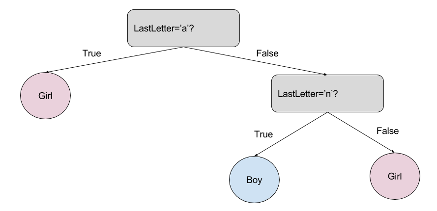

# Descripción - Automatización de modelos de datos

La automatización de los modelos que se detallan a continuación son basados en técnicas de aprendizaje de máquinas (Machine-Learning) de la fase de Intervinientes en donde el principal objetivo es realizar la clasificación del genero de cada uno de los intervinientes que no pudieron ser clasificados por ninguna de las técnicas inicialmente ejecutadas (Rangos de Cédula, Diccionario, Similaridad).

La selección del modelo más adecuado para realizar esta clasificación se fundamentó inicialmente en una revisión tanto como de literatura y repositorios de código en los que ya se hubiese tratado de abordar esta clasificación de genero únicamente basado en el nombre de los individuos. En este orden de ideas los modelos evaluados fueron Naive Bayes y Arboles de Decisión (Decision Trees). Vale la pena destacar que, aunque existen otros tipos de modelos, se trataron de seleccionar aquellos que más se acomodaran al contexto temático de los nombres a clasificar. En otras palabras, que se pudiesen adaptar al contexto nacional e idiomático.

1. [Método de Naive Bayes](#1naive_bayes)
2. [Método de Arboles de Decisión](#2decision_trees)

## 1.	Método de Naive Bayes:

**Descripción**

*    El primer modelo seleccionado para experimentación es conocido como Naive Bayes (Clasificador Bayesiano Ingenuo). Este modelo utilizado generalmente en procesos de clasificación está soportado en la técnica de clasificación estadística (probabilística) del Teorema de Bayes. Este teorema asume desde un principio que las variables predictoras son independientes entre sí, en donde la presencia de una determinada característica o atributo no se encuentra relacionada en absoluto con la presencia de otra característica. A modo de ejemplo, las características asociadas a la descripción de una fruta como la sandía (color: verde, forma: elíptica, peso: 12kg, etc.) aportan de forma individual a la probabilidad de que la fruta que estamos analizando sea una sandía.

*    El empleo de este algoritmo específicamente para la predicción de genero está basado en artículos  como el de [Zhao H. & Kamareddine(2017)](http://www.macs.hw.ac.uk/~hz103/CSCI'17.pdf), [Akbar R.(2016)](https://www.researchgate.net/publication/308785770_Gender_Classification_of_Indonesian_Names_Using_Multinomial_Naive_Bayes_and_Random_Forrest_Classifiers), [Bird S.et al.(2009)](https://www.nltk.org/book/ch06.html); sin embargo debido al contexto idiomático y regional uno de los que mas se ajustaban era el algoritmo desarrollado por [Gil M.(2017)](https://www.kaggle.com/migalpha/spanish-names) dispuesto en el repositorio de Kaggle. Otra de las ventajas iniciales de este repositorio es que contaba con una amplia base de datos con nombres en español tanto de mujeres como de hombres (24756 y 24584 respectivamente). 

 
 Tomado de https://thatware.co/naive-bayes/

**Implementación**

*    Este algoritmo escrito en Python es adaptado e implementado desde Databricks tomando como datos de entrenamiento aquellos que inicialmente dispone el repositorio de Kaggle teniendo en cuenta que tienen un licenciamiento GPL2. 

*    Librerías propias de _Spark_ son utilizadas para el llamado de datos desde el Data Lake; una vez los datos son almacenados en variables, su administración, adecuación y manipulación se basa en el uso de Pandas.

*    El modelo Naive Bayes se implementa utilizando la librería de aprendizaje automático de código abierto _Scikit-learn_. La configuración del modelo se realiza teniendo en cuenta una distribución de los datos de entrenamiento y testeo del 80% y 20% respectivamente.

*    El modelo implementa el método _CountVectorizer_ con el fin de convertir en este caso la columna de texto (nombres de los intervinientes) en una matriz con valores de ocurrencia de cada uno de los términos que aparezcan en el texto. 

*    Seguidamente el modelo implementa el método _TfidfTransformer_ el cual realiza la transformación de la matriz de ocurrencias inicialmente calculadas en una matriz normalizada de ocurrencias.

*    Para la selección de los mejores hiper-parámetros se utiliza la librería _GridSearchCV_, la cual itera diferentes hiper-parámetros predefinidos y ajusta el modelo sobre los datos de entrenamiento. Una vez ajustado el modelo se calcula la precisión (_Accuracy_) arrojando como resultado 0.85.

*    El modelo es almacenado en formato ._pkl_ con el fin de automatizar posteriores ejecuciones e invocaciones del mismo para distintos datos a predecir.

*    Una vez el modelo es salvado se selecciona el conjunto de datos y campo que contienen los nombres de los intervinientes para clasificación de genero, en donde su predicción es calculada en un nuevo campo que se añadirá al conjunto de datos iniciales. Los datos finales son luego exportados y almacenados en el Data Lake a través de librerías de _Spark_.

*    La correspondiente validación y conclusiones del modelo podrán observarse en la sección 10.

## 2.	Método de Arboles de Decisión

**Descripción**

*    El segundo modelo seleccionado e implementado para la clasificación de genero esta basado en Decision Trees (Arboles de Decision). Este modelo se basa en un diagrama o mapa de todos aquellos posibles resultados que dependen de decisiones relacionadas. El diagrama contiene nodos de decisión que validan los valores de las características y nodos de hoja que asignan un respectivo etiquetado. Generalmente el modelo comienza desde un nodo raíz donde se toma una decisión inicial basada en una condición que verifica un correspondientes valor de entrada; dependiendo del cumplimiento o no de la condición se selecciona una rama acorde a la característica validada. Continuando por la rama se puede o no encontrar un nuevo nodo de decisión con una nueva condición para seleccionar una nueva rama. Este proceso se sigue iterando hasta que no se encuentren mas condiciones y se alcance un nodo terminal (etiquetado) que asignará una etiqueta para el valor de entrada.

*    El uso de este algoritmo para la predicción de género basado en el nombre de las personas está apoyado en artículos como el del portal web de [Natural Language Processing for Hackers](https://nlpforhackers.io/introduction-machine-learning/), [Bird S.et al.(2009)](https://www.nltk.org/book/ch06.html) o el repositorio de código en GitHub de [Agbe J. (JCharis)](https://github.com/Jcharis/Python-Machine-Learning/blob/master/Gender%20Classification%20With%20%20Machine%20Learning/Gender%20Classification%20of%20Names%20With%20Machine%20Learning.ipynb). 

*    Aunque ninguno de estos algoritmos mencionados ha sido diseñado para ser aplicado en la clasificación de genero basado en nombres en español, fundamentan su aplicación para el primer nombre de una persona e implementan una extracción de características (_feature extraction_) muy importantes a la hora de evaluar los nombres de una persona para identificar el género. Dentro de esta extracción se encuentra la evaluación de cada una de las primeras tres letras y las tres últimas letras del nombre.

 

Tomado de https://nlpforhackers.io/introduction-machine-learning/

**Implementación**

*    Este algoritmo escrito en Python es adaptado e implementado desde Databricks tomando como datos de entrenamiento aquellos primeros nombres de intervinientes que fueron sujetos de una evaluación de frecuencia y revisión manual para la configuración de un conjunto de datos que se adaptasen de forma más cercana a las condiciones socio-culturales e idiomáticas de nombres registrados Colombia. De esta forma se conforma un conjunto de datos posee alrededor de 1500 nombres de hombres y mujeres con los cuales se entrena el modelo de árboles de decisión.

*    De nuevo librerías propias de _Spark_ son utilizadas para el llamado de datos desde el Data Lake; una vez los datos son almacenados en variables, su administración, adecuación y manipulación se basa en el uso de Pandas.

*    El modelo de Decision Trees se implementa utilizando la librería de aprendizaje automático de código abierto _Scikit-learn_. 

*    El modelo también implementa el método _CountVectorizer_ con el fin de convertir en este caso la columna de texto (nombres de los intervinientes) en una matriz con valores de ocurrencia de cada uno de las letras que aparezcan en el texto del nombre para luego transformar y ajustar la matriz.

*    Seguidamente se extraen (_feature extraction_) en un diccionario la primera letra, primeras dos letras, primeras tres letras, ultima letra, ultimas dos letras y ultimas tres letras para cada uno de los nombres. 

*    Estas características luego son vectorizadas utilizando el método _vectorize_ de la librería _numpy_ y organizadas en un nuevo diccionario utilizando el método _DictVectorizer_ para ajustar un nuevo conjunto de datos de entrenamiento considerando las características extraídas.

*    Se configura el modelo para ser ejecutado desde una nueva función, teniendo en cuenta una distribución de los datos de entrenamiento y testeo del 80% y 20% respectivamente. La precisión del modelo (_Accuracy_) sobre los datos de testeo arroja un valor de 0.89.El modelo es salvado en formato ._pkl_ para futuras automatizaciones.

*    Posteriormente la rutina invoca el modelo seleccionando el conjunto de datos y campo que contienen los nombres de los intervinientes para clasificación de genero considerando únicamente el primer nombre. La predicción es calculada en un nuevo campo que se añadirá al conjunto de datos iniciales. Los datos finales son luego exportados y almacenados en el Data Lake a través de librerías de _Spark_.

*    La correspondiente validación y conclusiones del modelo podrán observarse en la sección 10.
