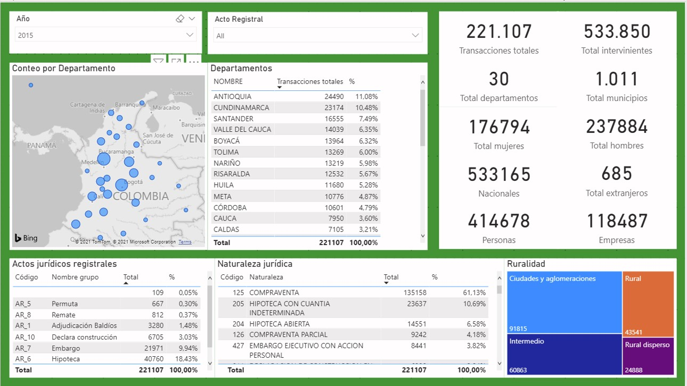

# Publicación de resultados

- [Publicación de resultados](#publicación-de-resultados)
  - [Conjuntos de datos](#conjuntos-de-datos)
  - [Entrega de resultados a usuarios](#entrega-de-resultados-a-usuarios)
  - [Modelamiento en PowerBI](#modelamiento-en-powerbi)
  - [Prototipado de visualización](#prototipado-de-visualización)
  - [Visualización de datos y tableros de control utilizando PowerBI](#visualización-de-datos-y-tableros-de-control-utilizando-powerbi)

## Conjuntos de datos 

A partir de las tareas realizadas de ingeniería de datos y analítica se derivaron los siguientes conjuntos de datos con los resultados del proyecto: 

* **Transacciones Rurales:** 991.084 registros  ( 937.504  rurales + 53.580 inferidas).  Transacciones relacionadas con predios rurales.
  
* **Linderos:** 998.579 registros. Linderos asociados a las transacciones rurales

* **Intervinientes:** 2.380.803 registros.  Intervinientes que participan en las transacciones rurales. 

* **Cruce con catastro alfanumérico (R1R2):** 107.486 registros.  Registros relacionados con la información alfanumérica de catastro.

* **Cruce con Catastro geográfico:** 80.119 registros. Registros relacionados con la información geográfica de catastro.

Los conjuntos de datos obtenidos como resultado  se relacionan entre sí de la forma descrita a través del siguiente gráfico:

## Entrega de resultados a usuarios

Teniendo en cuenta que en la actualidad la UPRA no tiene a su disposición en su entorno   de Microsoft Azure para analítica y que en su infraestructura local tampoco cuenta con un   herramientas para soporte de trabajos  analíticos tales como bodegas de datos, herramientas avanzadas para BI y   plataformas de data science, con el fin de poder disponer los resultados a los usuarios temáticos se optó por el siguiente escenario:

* De manera inicial, y con el fin de facilitar  a los usuarios temáticos el acceso y consulta de los resultados obtenidos en el proyecto,  se  realizó la creación de diferentes tableros de control utilizando la versión básica de la herramienta PowerBI (PowerBI Desktop https://powerbi.microsoft.com/es-es/desktop/ ).  Dicho componente de software permite a los usuarios la realización de consultas interactivas de manera desconectada.

* Se planteó al comité de arquitectura empresarial de la UPRA la necesidad que tiene la entidad de disponer un ecosistema de herramientas para analítica y Big Data basado en tecnologías de computación en la nube.  Dicho ambiente se requiere no solo para  disponer de en línea y de forma colaborativa  los resultados del presente proyecto,  sino también como mecanismo facilitador para que la entidad continúe  desarrollando proyectos de ciencia de datos.

## Modelamiento en PowerBI

Utilizando las capacidades de ETL y _Data Modeling_ que posee PowerBI se creo un modelo relacionando los conjuntos de datos de resultados con dimensiones adicionales de interés para los usuarios temáticos de la entidad.

En la imagen a continuación puede visualizarse parte del modelo creado:

## Prototipado de visualización 

Con el fin de poder establecer los requerimientos de los usuarios temáticos respecto a la consulta y visualización interactiva de los resultados del proyecto, se procedió a realizar una serie de reuniones donde se definieron prototipos no funcionales (_Mockups_) a través de los cuales se establecieron los elementos principales que deberían tener los diferentes tableros de control a implementar por el equipo de científicos de datos del proyecto.

A continuación se muestra un ejemplo de los _Mockups_ propuestos inicialmente:

Durante las revisiones de los _Mockups_ se encontró en algunas veces la necesidad de incluir nuevas dimensiones dentro del modelo definido en la herramienta de BI, así como la necesidad de generar nuevos  atributos o cálculos adicionales utilizando ya sea Power Query ( https://docs.microsoft.com/en-us/power-query/power-query-quickstart-using-power-bi ) o DAX  (https://docs.microsoft.com/en-us/power-bi/transform-model/desktop-quickstart-learn-dax-basics) 

## Visualización de datos y tableros de control utilizando PowerBI

Una vez se validaron los _Mockups_ de los tableros de control con los usuarios, se procedió a la implementación  de los mismos utilizando las herramientas disponibles de visualización en PowerBI.

Ejemplo de tablero de control:

Los diferentes archivos _.pbix_ creados por el grupo de analítica fueron entregados a los usuarios temáticos según las recomendaciones impartidas por la entidad.