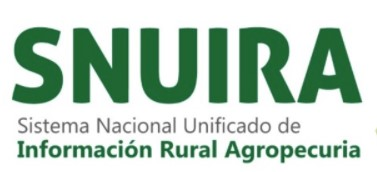

 # Prototipo - Mercado de Tierras UPRA - Laboratorio de datos SNUIRA

## Qué queremos?

Proponer y evaluar una arquitectura y metodología para analítica de Big Data en la nube que permita al laboratorio de datos de SNUIRA el desarrollo de proyectos de analítica para el sector agro.

Para materializar la arquitectura propuesta se propone un primer proyecto piloto de analítica orientado a facilitar y agilizar el monitoreo, la identificación de tendencias y proyección del comportamiento de la dinámica del mercado de tierras rurales agropecuarias en Colombia, aplicando técnicas de análisis de datos a partir de fuentes de información heterogéneas como son las transacciones inmobiliarias, actos registrales e información catastral, entre otros.

##  Contenido

__(Proyecto en construcción)__

 Estructura de carpetas:

 * 01_Gestion :  Documentos de planificación y gestión de proyectos. Metodología
   * 01_01_Seguimiento:  Reporte de seguimiento semanal
 * 02_Arquitectura: Arquitectura del sistema
 * 03_Presentaciones: Documentos y presentaciones preparados para compartir información sobre el proyecto.
 * 04_Entendimiento_Negocio: Entendimiento del negocio
 * 05_Descubrimiento_Datos: Descubrimiento datos
   *  05_01_Diccionario_Datos: Diccionarios de datos
   *  05_02_Perfilamiento_Datos: Reportes de perfilamiento de datos
 * 06_Preparacion_Datos: Preparación de datos
 * 07_Validacion_Datos: Validación de datos
 * 08_Analisis: Análisis de datos
 *  * 08_01_Modelos: Modelos de análisis
 * 09_Automatizacion: Automatización de modelos analíticos
 * 10_Validacion_Evaluacion_Modelos: Validación y evaluación de los modelos analíticos
 * 11_Publicacion_Modelos: Publicación de modelos y resultados
 * 12_Lecciones_Aprendidas: Lecciones aprendidas y recomendaciones
 * 13_Datos
 * 14_Codigo_Fuente

